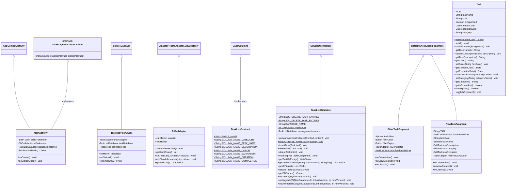

```mermaid
classDiagram
    AppCompatActivity <|-- MainActivity
    TaskFragmentCloseListener <|-- MainActivity : implements
    SimpleCallback <|-- TaskRecyclerSwipe
    Adapter~ToDoAdapter.ViewHolder~ <|-- ToDoAdapter
    BaseColumns <|-- TaskListContract : implements
    SQLiteOpenHelper <|-- TaskListDatabase
    BottomSheetDialogFragment <|-- FilterTaskFragment
    BottomSheetDialogFragment <|-- NewTaskFragment
    class MainActivity {
        - List~Task~ tasksToRender
        - ToDoAdapter toDoAdapter
        - TaskListDatabase databaseInstance
        - boolean isFiltering = false
        #onCreate() void
        +onDialogClose() void
    }
    class ToDoAdapter {
        -List~Task~ taskList
        -onBindViewHolder() void
        ViewHolder
        +getItemCount() int
        +setTaskList(List~Task~ newList) void
        +editTaskInformation(int position) void
        +getTaskList() List~Task~
    }
    class TaskFragmentCloseListener 
    <<interface>> TaskFragmentCloseListener
    TaskFragmentCloseListener : onDialogClose(DialogInterface dialogInterface)
    class Task {
        - int id
        - String taskName
        - String color
        - boolean isExpanded
        - Date creationDate
        - Date expirationDate
        - String category
        +getFormattedDate() String$
        +setId() void
        +setTaskName(String name) void    
        +getTaskName() String
        +setTaskDescription(String description) void
        +getTaskDescription() String
        +getColor() String
        +setColor(String hexColor) void
        +getCreationDate() Date
        +getExpirationDate() Date
        +setExpirationDate(Date expiration) void
        +setCategory(String categoryName) void
        +getCategory() String
        +getIsExpanded() boolean
        +hasExpired() boolean
        +toggleIsExpaned() void
    }
    class TaskRecyclerSwipe {
        -ToDoAdapter mainAdapter
        -TaskListDatabase taskDatabase
        -Resources getResources
        +onMove() boolean
        +onSwiped() void
        +onChildDraw() void
    }
    class TaskListContract {
        +String TABLE_NAME$
        +String COLUMN_NAME_CATEGORY$
        +String COLUMN_NAME_TASK_NAME$
        +String COLUMN_NAME_DESCRIPTION$
        +String COLUMN_NAME_COLOR$
        +String COLUMN_NAME_EXPIRATION$
        +String COLUMN_NAME_CREATION$
        +String COLUMN_NAME_COMPLETION$
    }
    class TaskListDatabase {
        -String SQL_CREATE_TASK_ENTRIES$
        -String SQL_DELETE_TASK_ENTRIES$
        -String DATABASE_NAME$
        -int DATABASE_VERSION$
        -TaskListDatabase managementInstance$
        +getManagementInstance(Context context)$ void
        +setDATABASE_NAME(String name)$ void
        +insertTask(Task task) void
        +deleteTask(Task task) void
        +deleteTask(int id) void
        +markExpiredTasksCompleted() void
        +getTaskByExpiry() List~Task~
        +getTaskFromFilter(String columnName, String key) List~Task~
        +getAllTasks() List~Task~
        +updateTask(Task task) void
        +getDBCursor() Cursor
        +onCreate(SQLiteDatabase db) void
        +onUpgrade(SQLiteDatabase db, int oldVersion, int newVersion) void
        +onDowngrade(SQLiteDatabase db, int oldVersion, int newVersion) void
    } 
    class FilterTaskFragment {
        -Spinner taskFilter
        -Button filterColor
        -Button filterExpiry
        -ToDoAdapter toDoAdapter$
        -TaskListDatabase databaseHelper$
        +onCreateView() void
        +onViewCreated() void
        +onDismiss() void
    }
    class NewTaskFragment {
        -String TAG$
        -TaskListDatabase databaseHelper
        -String taskColor
        -EditText taskName
        -EditText taskDescription
        -EditText taskCategory
        -EditText taskExpiration
        -ToDoAdapter mainToDoAdapter
        +onCreateView() void
        +onViewCreated() void
        +onDismiss() void
    }
```
